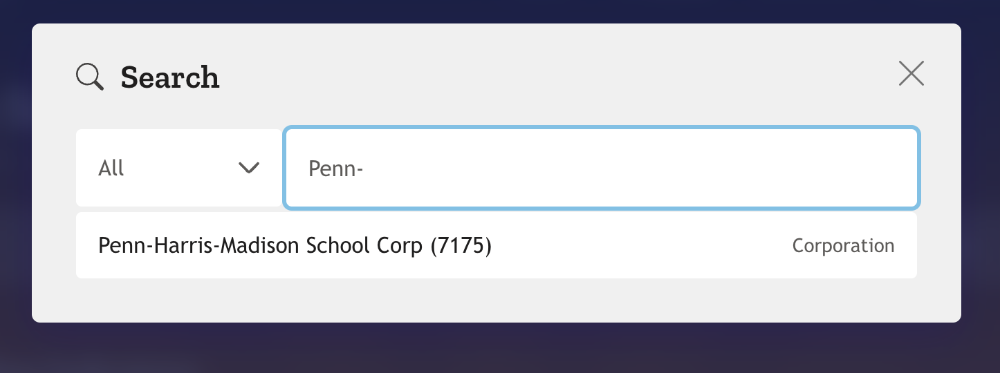
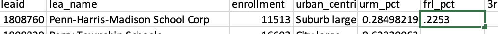
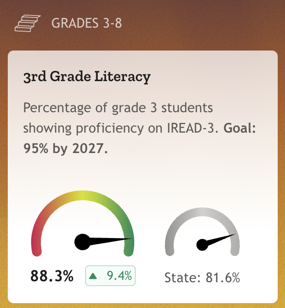
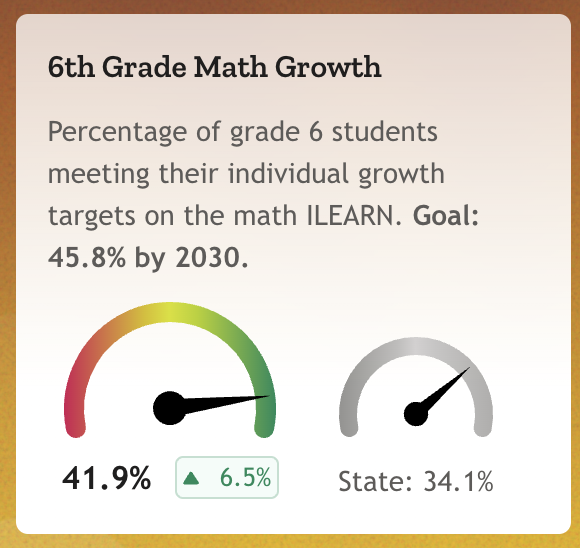
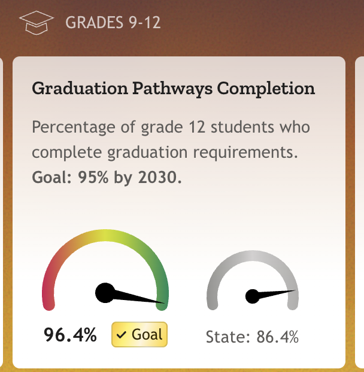
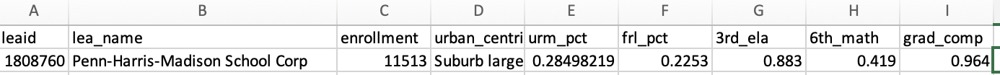

# District Opporunity Score

## How to add data

1. Open your spreadsheet, which is in CSV format. Ignore the message about "Possible Data Loss," it's no big deal.
2. Navigate to the [IDOE GPS website](https://indianagps.doe.in.gov/).
3. If it leads you through some sort of orientation, feel free to click on "Skip" to get to the main page.
4. Click on the "🔎 Search" tab and start typing the name of the school corporation you want to add data for. When it appears in the list, click on it. For the purposes of this example, we'll use "Penn-Harris-Madison School Corporation."

1. When the school corporation's page loads, identify the percentage of students who qualify for free and reduced lunch.

We want it as a decimal number, so just move the decimal point over two places to the left. For example, if the percentage is 22.53%, we want to enter 0.2253 in the spreadsheet under `frl_pct`.

2. Now identify the percentage of students in the 3rd grade who have scored proficient or above on the IREAD-3 test. Again, we want it as a decimal number, so just move the decimal point over two places to the left. For example, if the percentage is 88.33%, we want to enter 0.883 in the spreadsheet under `3rd_ela`.

3. Next, identify the percentage of 6th graders meeting their math growth rates. Again, we want it as a decimal number, so just move the decimal point over two places to the left. For example, if the percentage is 41.9%, we want to enter 0.419 in the spreadsheet under `6th_math`.

4. Lastly, identify the percentage of 12th grade students who have completed graduation pathways requirements. Again, we want it as a decimal number, so just move the decimal point over two places to the left. For example, if the percentage is 96.4%, we want to enter 0.964 in the spreadsheet under `12th_comp`.

5. And that's it for one of the school corporations! It should look something like this:

6. As a file stored on Teams, it does get saved as you work. However, it is always a good idea to save your work, so click on "File" and then "Save" or ⌘-S to save the file. Ignore the message about "Possible Data Loss," it's no big deal.
7. Send me an e-mail when you are done, and I will take care of the rest. Thanks!

